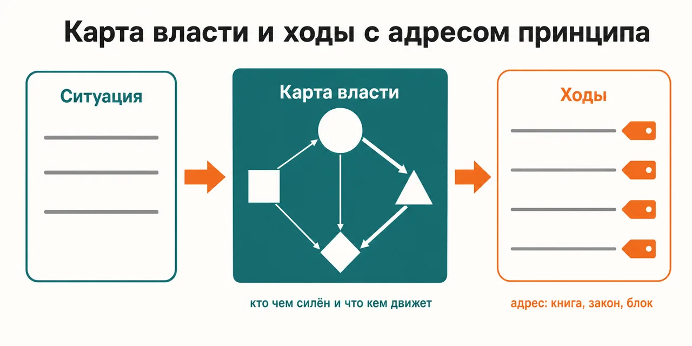
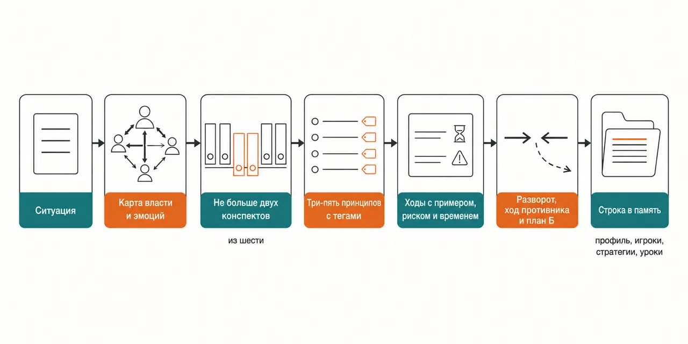

Русский · [English](README.en.md)

# Пять книг про власть и людей прочитаны, а в нужный момент ни один принцип не всплывает

Ситуация раскладывается на карту власти, из 176 принципов пяти книг Грина отбираются три-пять
подходящих именно к ней, и у каждого совета стоит адрес: книга, закон, блок конспекта.

```
claude plugin marketplace add https://github.com/beCyborg/jadlis-start.git
claude plugin install robert-greene@jadlis
```

Ключей и подписок сверх Claude Code не нужно, в интернет плагин не ходит — конспекты пяти книг
лежат внутри него; настройка одна, папка памяти, и без неё совет тоже отвечает, просто не помнит
прошлых разговоров.



Текстом: слева ситуация своими словами, в середине карта власти — кто чем силён и что кем движет, —
справа три-пять ходов, у каждого тег вида `[48LP:L1]` с адресом принципа.

Это моё рабочее место, выложенное как есть, а не продукт: чем перестал пользоваться — убрал.

## Было → стало

| Руками | Чатом с ИИ | Этим плагином |
|---|---|---|
| **Как найти нужный принцип.** Книги стоят на полке, а ситуация случается в понедельник утром. | Отвечает по общей памяти обо всех книгах сразу, и выходит усреднённый пересказ. | По типу ситуации подгружается не больше двух файлов-конспектов, из них отбираются три-пять принципов. |
| **Откуда взялся совет.** Формулировка помнится, книга и номер закона — уже нет. | Звучит похоже на Грина, а сверить не с чем. | Каждая рекомендация несёт тег вида `[48LP:L1]` — адрес блока в конспекте, который лежит у тебя на диске. |
| **Чего закон не покрывает.** Закон запоминается без оговорок, в которых он не работает. | Оговорки не выдаёт, пока не спросишь про них отдельно. | У каждого принципа в конспекте записаны AVOID WHEN и Reversal, и разворот обязан быть в ответе. |
| **Ход другой стороны.** Свои ходы считаешь, чужие додумываешь по настроению. | Разбирает твою позицию, потому что про неё ты и спросил. | Отдельным шагом те же принципы применяются к оппоненту, туда же уходит запасной план. |
| **Что осталось после разговора.** Разговор закончился, а потом не вспомнить, какой ход выбрал и почему. | Новая сессия начинается с чистого листа. | В папке памяти лежат профиль, карта игроков кодами, активные стратегии и уроки с исходом. |

## Как это работает



На входе — ситуация своими словами: кто участвует, какая у тебя позиция, чего ты хочешь и чего
делать нельзя.
Внутри — четыре шага подряд: карта власти и эмоций, отбор трёх-пяти принципов с тегами, ходы с
историческим примером и риском, контр-разбор со стороны оппонента.
На выходе — ответ, где у каждого хода назван источник, и запись в файл памяти.

Текстом: ситуация → карта власти и эмоций → не больше двух конспектов → три-пять принципов с
тегами → ходы с примером, риском и временем → разворот, ход противника и план Б → строка в память.

Читает совет шесть файлов-конспектов: власть и влияние, убеждение, стратегия и конфликт,
мастерство, человеческая природа и сквозные паттерны. Маршрут задан таблицей: тип ситуации →
основной файл → запасной, и больше двух файлов за запрос не грузится. Внутри — все 48 законов
власти, все 33 стратегии войны, все 18 законов человеческой природы, характеры и шаги «Искусства
обольщения» и главы «Мастерства»: 176 принципов, у каждого свой адрес.

Тег — адрес блока внутри плагина, а не ссылка на страницу книги: конспекты написаны заново,
дословных выдержек в них нет, а примеры стареют вместе с книгами; это записано в
`NOTICE.md`. Оптика авторская и мягче не делается: скиллу предписано описывать, как
власть работает, а не как она должна была бы работать, и не добавлять моральных оговорок, которых
нет у автора; когда манипулируют тобой, он разбирает, по каким признакам это видно.

[уточнить] — команды или скрипта, который проверяет, что тег существует в конспектах, в
репозитории нет.

## Установка и первый запуск

**а) Текст для вставки агенту.** Скопируй целиком в чат Claude Code:

```
Ты — установщик. Поставь на этот Mac плагин robert-greene из маркетплейса jadlis.
Выполни ровно эти команды, дословно, ничего не сокращая:
1. claude plugin marketplace add https://github.com/beCyborg/jadlis-start.git
2. claude plugin install robert-greene@jadlis
3. claude plugin list — покажи мне строку про robert-greene и его версию.
Ключей и внешних программ этому плагину не нужно. Настройка одна — папка памяти MEMORY_DIR:
спроси у меня путь, покажи, куда он записан, и на этом остановись. Содержимое папки не читай
и никуда не копируй.
Перед каждой командой покажи её мне целиком и дождись «да». Сказал «нет» — не выполняй,
скажи, что именно пропустил, и иди дальше.
Команда вернула ошибку — остановись, покажи вывод, к следующей не переходи.
```

**б) Команды руками.**

```
claude plugin marketplace add https://github.com/beCyborg/jadlis-start.git
claude plugin install robert-greene@jadlis
claude plugin list
```

Первая команда ничего не ставит — она добавляет маркетплейс. Ставит только вторая, и снимается
она одной строкой: `claude plugin uninstall robert-greene@jadlis --keep-data`.

Папку памяти можно задать сразу при установке — `claude plugin install robert-greene@jadlis
--config MEMORY_DIR=~/advisors-memory`, — а можно потом: `/plugin` → robert-greene → settings →
`MEMORY_DIR`. На уже установленном плагине флаг `--config` молча ничего не меняет, поэтому смена
пути через него означает переустановку (проверено 07.09.2026). Значение по умолчанию —
`~/advisors-memory`; настройка необязательная, без неё совет отвечает и говорит, что не запомнит
сессию. Скелет папки разворачивается при первом прогоне и существующих файлов не трогает; папка
общая для всех советов Jadlis, профиль этого совета — `Профили/green-advisor.md`.

**в) Короткая команда.** Открой Claude Code в папке, где работаешь, и набери:

```
/robert-greene <ситуация>
```

Не находится — сверь имя строкой `claude plugin list`. Ситуацию описывай своими словами: кто
участвует, чем каждый силён, чего ты хочешь и чего делать не готов; без игроков и расстановки сил
ответ выходит общим — это ограничение метода, а не забывчивость плагина.

## Границы, стоимость, обновление

**Чего не делает.** Не собирает совет из линз и не гоняет скептиков по утверждениям — это
`advisor-decision` и соседние советы, здесь одна авторская оптика без усреднения. Не проверяет
утверждения перекрёстно и не ходит в интернет: свежих данных о твоём рынке и твоих людях у него
нет. Не заменяет юриста, врача и терапевта, не берёт на себя последствия: решение и ответственность
остаются у тебя. Не выдаёт цитаты из книг — внутри производные конспекты, права на исходные тексты
у авторов и издателей (`NOTICE.md`). И не принимает правку этого репозитория: он
генерируется из закрытого источника, CI сверяет хеш со `SHARED_FROM.txt`, поэтому прямая правка
валит сборку — issue сюда, изменение уходит в источник.

**Что нужно.** Ключей не нужно, платных подписок сверх самого Claude Code тоже, внешних программ
нет. Единственная настройка — `MEMORY_DIR`, обычная папка с markdown-файлами на твоём диске; она
приватная, там оседают игроки, стратегии и исходы, поэтому в публичный git её класть нельзя.

**Порядок расхода токенов.** Прогон лёгкий: один скилл, без фан-аута субагентов; за запрос
подгружается не больше двух файлов-конспектов, остальные лежат нетронутыми. Дороже прочего выходит
длинная ситуация с большим числом игроков — там растёт вход, а не число вызовов.

**Проверено там, где я работаю:** мой Mac, моя подписка. Где ещё это работает — [уточнить].

**Условия использования.** Лицензии нет: все права сохранены за автором. Читать и
пользоваться лично можно. Коммерческое использование, переиздание и включение в свои
продукты — по договорённости со мной.

**Обновление.** У стороннего маркетплейса авто-обновление на твоей стороне выключено: пока не
запустишь первую команду, у тебя остаётся та версия, которую ты поставил.

```
claude plugin marketplace update jadlis
claude plugin update robert-greene@jadlis
claude plugin list
```

Переустановка, если что-то встало криво:

```
claude plugin uninstall robert-greene@jadlis --keep-data && claude plugin install robert-greene@jadlis
```
